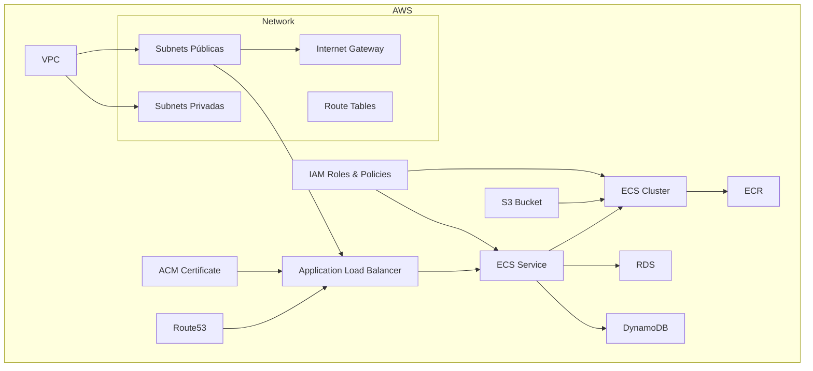

# 📦 Projeto Terraform – Infraestrutura AWS Classic

Este projeto provisiona uma infraestrutura completa na **AWS** utilizando **Terraform**, organizada por arquivos numerados para facilitar leitura, manutenção e evolução da arquitetura.

---

## 🗺️ Diagrama da Arquitetura (Mermaid)



📁 Estrutura do Projeto

---

```bash
.
├── 00-provders.tf
├── 01-network.tf
├── 02-s3.tf
├── 03-sg.tf
├── 04-ecr.tf
├── 05-dynamodb.tf
├── 06-rds.tf.old
├── 07-acm.tf
├── 08-ecs_cluster.tf
├── 09-ecs_service.tf
├── 10-load_balance.tf
├── 11-iam_policy.tf
├── 12-iam_role.tf
├── 13-route53.tf
├── 14-output.tf
├── 15-variables.tf
├── ENVIRONMENT_STEST.s3.tfbackend.EXAMPLE
├── ENVIRONMENT_STEST.tfvars..EXAMPLE
└── README.md
```

🧩 Descrição dos Arquivos

---

# Arquivo Função

- 00-provders.tf Configuração do provider AWS
- 01-network.tf Criação da VPC, subnets, IGW e rotas
- 02-s3.tf Criação do bucket S3
- 03-sg.tf Security Groups
- 04-ecr.tf Repositório ECR
- 05-dynamodb.tf Tabela DynamoDB
- 06-rds.tf.old Definição antiga de RDS (desativada)
- 07-acm.tf Certificado SSL (ACM)
- 08-ecs_cluster.tf Cluster ECS
- 09-ecs_service.tf Serviço ECS
- 10-load_balance.tf Application Load Balancer
- 11-iam_policy.tf IAM Policies
- 12-iam_role.tf IAM Roles
- 13-route53.tf DNS (Route53)
- 14-output.tf Outputs
- 15-variables.tf Variáveis

---

# Arquivos de Ambiente

ENVIRONMENT_STEST.s3.tfbackend.EXAMPLE Backend remoto S3
ENVIRONMENT_STEST.tfvars..EXAMPLE Variáveis de ambiente

🧪 Arquivos de Ambiente

---

🔹 Backend (S3)
ENVIRONMENT_STEST.s3.tfbackend.EXAMPLE
Exemplo:

```t
bucket         = "tfstate-bucket"
key            = "infra-aws/terraform.tfstate"
region         = "us-east-1"
dynamodb_table = "terraform-lock"
encrypt        = true
```

🔹 Variáveis
ENVIRONMENT_STEST.tfvars..EXAMPLE
Contém:

- region

- project_name

- vpc_cidr

- subnets

- domain_name

- container_image

- desired_count

🚀 Como Usar

---

1️⃣ Copiar arquivos de exemplo

```bash
cp ENVIRONMENT_STEST.s3.tfbackend.EXAMPLE ENVIRONMENT_STEST.s3.tfbackend
cp ENVIRONMENT_STEST.tfvars..EXAMPLE ENVIRONMENT_STEST.tfvars
```

2️⃣ Inicializar Terraform

```bash
terraform init -backend-config=ENVIRONMENT_STEST.s3.tfbackend
```

3️⃣ Planejar

```bash
terraform plan -var-file=ENVIRONMENT_STEST.tfvars
```

4️⃣ Aplicar

```bash
terraform apply -var-file=ENVIRONMENT_STEST.tfvars
```

🏗️ Recursos Criados

---

- VPC

- Subnets públicas e privadas

- Internet Gateway

- Route Tables

- S3 Bucket

- DynamoDB

- ECR

- ECS Cluster

- ECS Service

- Application Load Balancer

- ACM Certificate

- IAM Roles

- IAM Policies

- Route53

🧠 Boas Práticas

---

- Infraestrutura como código

- Backend remoto com lock (DynamoDB)

- Separação por arquivos lógicos

- Uso de variáveis

- Uso de certificados ACM

- DNS automatizado

- Segurança via SG e IAM

- Padrão de nomes

📌 Requisitos

---

- Terraform >= 1.x

- AWS CLI configurado

- aws configure
